# Hashing

I have completed the Hashing course on TryHackMe , where I learned about the uses of hashing, hashing collisions, and how to recognize password hashes. I gained insights into the importance of salting passwords, the concept of rainbow tables, techniques for password cracking, and how to perform integrity checks. This knowledge is essential for cybersecurity professionals, as it enhances their ability to secure data and protect against various threats.

## Task2 Correct Answer
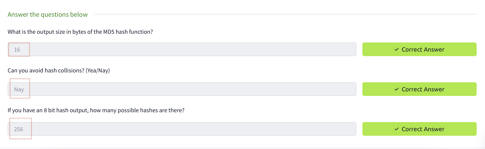

## Task3-1
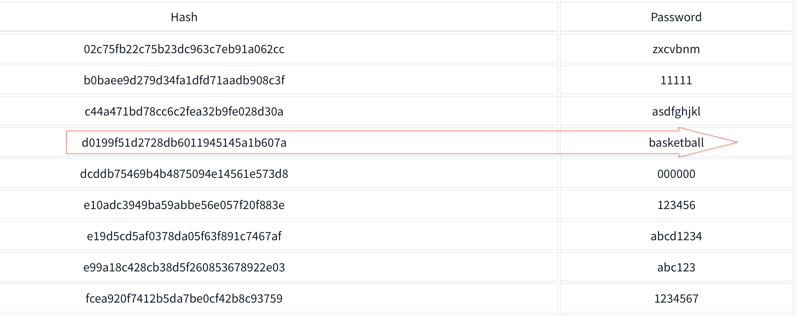

## Task3-2
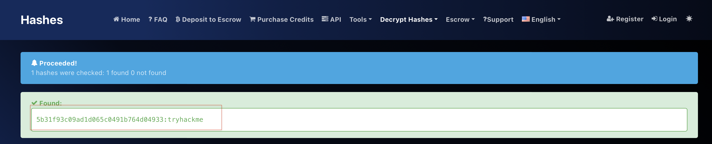

## Task3 Correct Answer
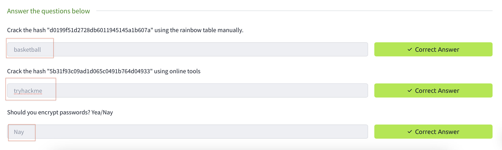

## Task4-2
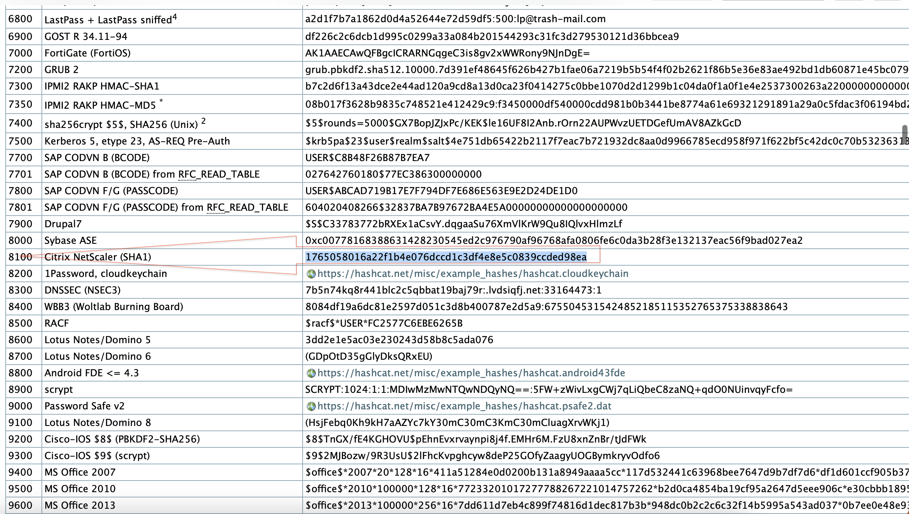

## Task4-3
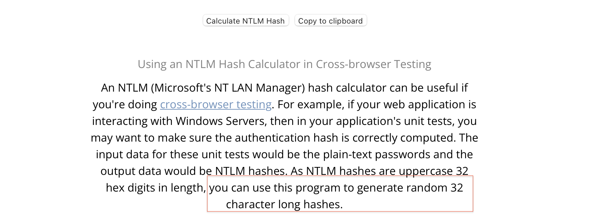

## Task4 Correct Answer
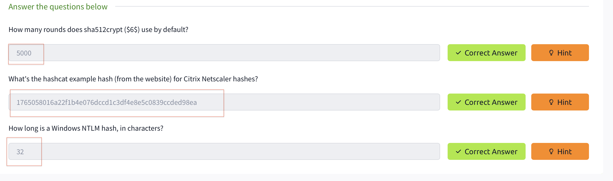

## Task5-1
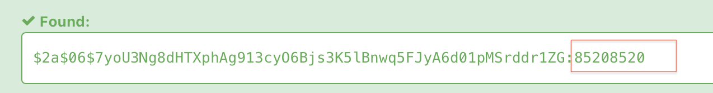

## Task5-2
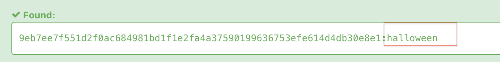

## Task5-3
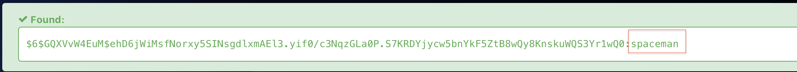

## Task5-4
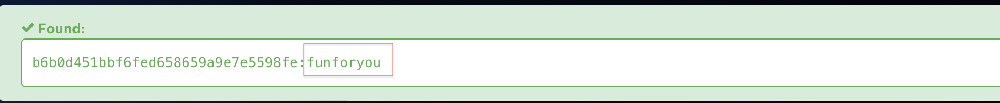

## Task5 Correct Answer
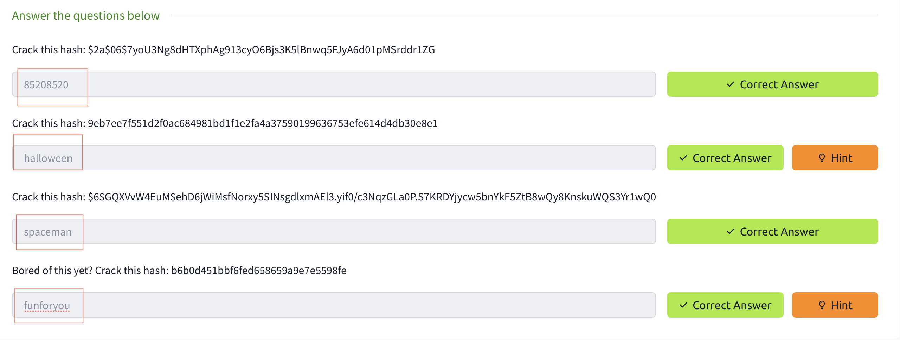

## Task6-2
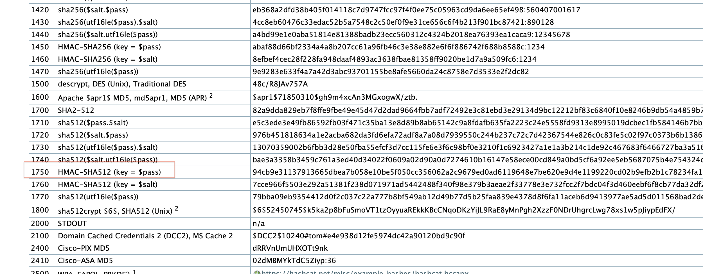

## Task6 Correct Answer
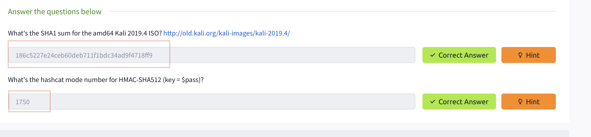

## All Task Completed
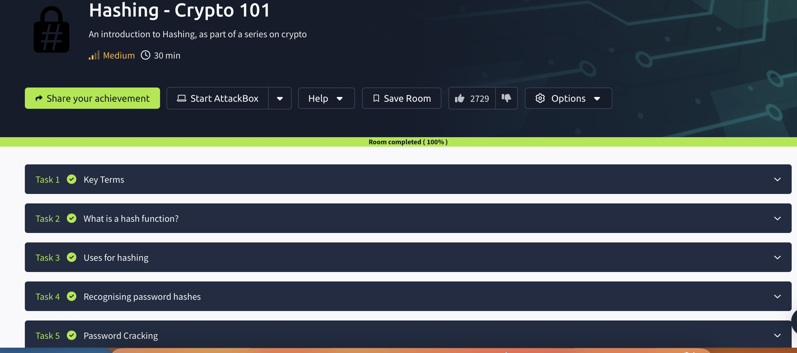
